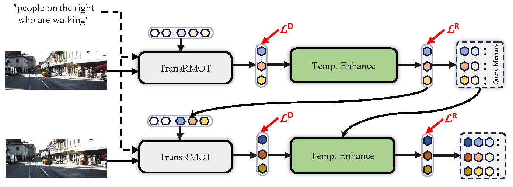

<div align="center">
<h1>
<b>
Bootstrapping Referring Multi-Object Tracking</b>
</h1>
</div>

<p align="center"></p>

> **[Bootstrapping Referring Multi-Object Tracking](http://arxiv.org/abs/2406.05039)**
>
> Yani Zhang, Dongming Wu, Wencheng Han, Xingping Dong

**Abstract.**
Referring multi-object tracking (RMOT) aims at detecting and tracking multiple objects following human instruction represented by a natural language expression. Existing RMOT benchmarks are usually formulated through manual annotations, integrated with static regulations. This approach results in a dearth of notable diversity and a constrained scope of implementation. In this work, our key idea is to bootstrap the task of referring multi-object tracking by introducing discriminative language words as much as possible. In specific, we first develop Refer-KITTI into a large-scale dataset, named Refer-KITTI-V2. It starts with 2,719 manual annotations, addressing the issue of class imbalance and introducing more keywords to make it closer to real-world scenarios compared to Refer-KITTI. They are further expanded to a total of 9,758 annotations by prompting large language models, which create 617 different words, surpassing previous RMOT benchmarks. In addition, the end-to-end framework in RMOT is also bootstrapped by a simple yet elegant temporal advancement strategy, which achieves better performance than previous approaches. 

## Getting Started
### Installation

The basic environment setup is on top of [MOTR](https://github.com/megvii-research/MOTR), including conda environment, pytorch version and other requirements. 

### Dataset
Please refer to the [guide](datasets/README.md) for downloading and organization.

### Training
You can download COCO pretrained weights from [Deformable DETR](https://github.com/fundamentalvision/Deformable-DETR) ''+ iterative bounding box refinement''.

Then training TempRMOT for Refer-OVIS as following:
```bash 
sh configs/temp_rmot_train.sh
```

Then training TempRMOT for Refer-OVIS with rk2 pretrained weights as following:
```bash 
sh configs/temp_rmot_train_rk2.sh
```

Note:
- If the RoBERTa is not working well, please download the RoBERTa weights from [Hugging Face](https://huggingface.co/roberta-base/tree/main) for local using.
- The checkpoint_rk2 weights can be found [here](https://github.com/zyn213/TempRMOT/releases/tag/v1.0).

### Testing
For testing on Refer-OVIS, you can run:
```bash
sh configs/temp_rmot_test.sh
```

You can get the main results by runing the evaluation part.
```bash
cd TrackEval/script
sh evaluate_rmot.sh
```

## Main Results

### Refer-OVIS

| **Method** | **Dataset** |  **Pretrain**   | **HOTA** | **DetA** | **AssA** | **DetRe** | **DetPr** | **AssRe** | **AssRe**                                                                                      | **LocA**                                                                          |                                           **URL**                                           |
|:----------:|:-----------:|:---------------:|:--------:|:--------:|:--------:|:---------:|:---------:|:---------:|------------------------------------------------------------------------------------------------|-----------------------------------------------------------------------------------| :-----------------------------------------------------------------------------------------: |
| TempRMOT  | Refer-OVIS  | Deformable-DETR |  22.734   |  11.234   |   46.625   |   20.02   |   19.91   |  56.555   | 67.611| 82.768 | [model](https://drive.google.com/file/d/1y8Sbz2rYuTIboxrGO8jdzBhtNJvwIHw_/view?usp=drive_link) |
| TempRMOT  | Refer-OVIS  | checkpoint_rk2  |  24.611   |  11.886   |   51.617   |   20.193   |   21.829   |  64.761   | 65.701| 82.517 | [model](https://drive.google.com/file/d/10i73P0f-8wZdK0OHey-bDgDRKHAP2ht4/view?usp=drive_link) |

### Refer-MOT17
| **Method** | **Dataset** |  **Pretrain**   | **HOTA** | **DetA** | **AssA** | **DetRe** | **DetPr** | **AssRe** | **AssRe**                                                                                      | **LocA**                                                                          |                                           **URL**                                           |
|:----------:|:-----------:|:---------------:|:--------:|:--------:|:--------:|:---------:|:---------:|:---------:|------------------------------------------------------------------------------------------------|-----------------------------------------------------------------------------------| :-----------------------------------------------------------------------------------------: |
| TempRMOT  | Refer-MOT17 | Deformable-DETR |  0.59603  |  0.042611  |   9.1714   |   0.048201   |   0.36561   |  11.659   | 56.583| 75.968 | [model](https://drive.google.com/file/d/1llQRbE70j7L43gonieM_GMhqM6KtKeaj/view?usp=drive_link) |
| TempRMOT  | Refer-MOT17  | checkpoint_rk2  |  2.4957   |  0.34994   |   20.068   |   0.56698   |   0.90229   | 27.155   | 37.495| 70.787| [model](https://drive.google.com/file/d/1GQ3Ui4-wr45zUHOW8CLhK4DSmyBDVYA2/view?usp=drive_link) |

### Refer-MOT20
| **Method** | **Dataset** |  **Pretrain**   | **HOTA** | **DetA** | **AssA** | **DetRe** | **DetPr** | **AssRe** | **AssRe**                                                                                      | **LocA**                                                                          |                                           **URL**                                           |
|:----------:|:-----------:|:---------------:|:--------:|:--------:|:--------:|:---------:|:---------:|:---------:|------------------------------------------------------------------------------------------------|-----------------------------------------------------------------------------------| :-----------------------------------------------------------------------------------------: |
| TempRMOT  | Refer-MOT20 | Deformable-DETR |  0.42845   |  0.065153   |   2.9708   |   0.095114   |   0.20551  |  5.5381  | 13.112| 64.431 | [model](https://drive.google.com/file/d/1yjkjWCo6UISNSjUx14DqhoR0s-U5g8K8/view?usp=drive_link) |
| TempRMOT  | Refer-MOT20  | checkpoint_rk2  |  0.33277   |  0.011678   |   11.525   |   0.51524   |   0.011947   |  22.567   | 21.443| 65.704 | [model](https://drive.google.com/file/d/1nf03F1JCFA-uDLyQsI6K9cYvXXk1fYNv/view?usp=drive_link) |


## Citation
If you find TempRMOT or Refer-KITTI-V2 useful in your research, please consider citing:
```bibtex
@article{zhang2024bootstrapping,
  title={Bootstrapping Referring Multi-Object Tracking},
  author={Zhang, Yani and Wu, Dongming and Han, Wencheng and Dong, Xingping},
  journal={arXiv preprint arXiv:2406.05039},
  year={2024}
}
```

## Acknowledgements
We thank the authors that open the following projects. 
- [RMOT](https://github.com/wudongming97/RMOT)
- [PF-Track](https://github.com/TRI-ML/PF-Track)
- [MOTR](https://github.com/megvii-research/MOTR)
- [Deformable DETR](https://github.com/fundamentalvision/Deformable-DETR)


